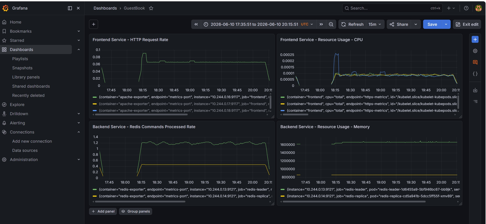

# 🚀 Pulumi Kubernetes Guestbook with Advanced Monitoring Suite

This repository extends the original Pulumi TypeScript Guestbook application by integrating native cluster-wide and application-level monitoring using the Prometheus Operator (`kube-prometheus-stack`) and Grafana Dashboards.



---

## 🛠️ Architectural Design Decisions & Code Modifications

## 📊 Data Collection Architecture & Flow

To bridge the gap between legacy components and modern cloud-native observability, the architecture handles metrics collection at two distinct layers: **Application/Software Telemetry** (via localhost sidecars) and **Infrastructure/Resource Usage** (via cgroups).

```text
┌────────────────────────────────────────────────────────────────────────────────────────┐
│ KUBERNETES POD BOUNDARY                                                                │
│                                                                                        │
│  ┌───────────────────────┐   Internal HTTP   ┌───────────────────────────┐             │
│  │ APPLICATION CONTAINER │  (localhost:80)   │     SIDECAR CONTAINER     │             │
│  │    (Apache/PHP App)   ├──────────────────►│     (apache-exporter)     │             │
│  │   /server-status?auto │                   │  Exposes /metrics (:9117) │             │
│  └───────────────────────┘                   └─────────────┬─────────────┘             │
│                                                            ▲                           │
└────────────────────────────────────────────────────────────┼───────────────────────────┘
                                                             │ Scrape Endpoint
                                                             │
                  ┌──────────────────────────────────────────┴──────────────┐            │
                  │              PROMETHEUS CORE ENGINE                     │            │
                  └──────────────────────────┬──────────────────────────────┘            │
                                             │                                           │
                                             │ Pulls Kernel Metrics                      │
                                             ▼                                           │
┌────────────────────────────────────────────────────────────────────────────────────────┘
│ NODE / KUBELET LEVEL                                                                   │
│                                                                                        │
│  ┌───────────────────────┐                                                             │
│  │   OS KERNEL CGROUPS   │◄───────────────── [ cAdvisor Agent ]                        │
│  │ (CPU/Memory isolation)│                  (Reads physical runtime container usage)   │
│  └───────────────────────┘                                                             │
└────────────────────────────────────────────────────────────────────────────────────────┘
```

### 1. Application-Level Metrics (Traffic & Request Rates)
- **Mechanism:** Containers inside the same Pod share the same network namespace and can communicate freely via `localhost`.
- **Flow:** The `apache-exporter` sidecar periodically queries the application's internal URL `http://localhost:80/server-status?auto`. It parses Apache's raw plaintext status into Prometheus-compatible metrics and exposes them at the `:9117/metrics` endpoint. The same local mechanism applies to Redis, where the `redis-exporter` connects to `localhost:6379` using the `INFO` database command [0.2].
- **Scraping:** Prometheus uses the declared `ServiceMonitor` to locate the pod's IP at port `9117` or `9121` and pulls the translated software metrics [0.2].

### 2. Infrastructure-Level Metrics (Resource Usage)
- **Mechanism:** Real hardware utilization (CPU and Memory) is managed and isolated by the Linux kernel using **cgroups (control groups)**.
- **Flow:** When the Helm chart `kube-prometheus-stack` is installed, it ensures telemetry collection from **cAdvisor** (embedded directly within the Kubelet on every node). 
- **Scraping:** `cAdvisor` monitors the cgroups definitions from the outside, capturing the exact physical clock cycles and memory footprints of the Guestbook containers. Prometheus scrapes these infrastructure providers directly. The application containers are completely unaware of this operation, ensuring zero runtime overhead for instrumentation.


The codebase inside `index.ts` was refactored and extended based on the following engineering validations:

### 1. The Sidecar Pattern for Application Instrumentation
* **The Challenge:** Black-box testing via `curl` revealed that the legacy PHP/Apache frontend and Redis instances do not expose native Prometheus `/metrics` endpoints.
* **The Solution:** Implemented the **Sidecar Pattern** inside the Deployment specs without altering the developers' original source code. 
  - Added a `lusotycoon/apache-exporter` container to the frontend Pod, translating internal Apache server status data via `localhost`.
  - Added an `oliver006/redis_exporter` container to both Redis Leader and Replica Pods, translating internal database health via `localhost`.

### 2. Service Metadata Corrections (Target Labels)
* **The Modification:** The original Pulumi example lacked explicit service-level metadata labels for the frontend. Explicit `labels: { app: "..." }` and explicit port naming (`name: "metrics-port"`) were injected into the `k8s.core.v1.Service` resources.
* **The Reason:** This ensures that the Prometheus Operator can discover the networking endpoints dynamically.

### 3. Native ServiceMonitor CRDs with Namespace Selection
* **The Modification:** Declared `k8s.apiextensions.CustomResource` blocks for `frontend-monitor`, `redis-leader-monitor`, and `redis-replica-monitor`.
* **The Reason:** Instead of legacy annotations, modern Prometheus Operators rely on `ServiceMonitor` Custom Resources. The property `namespaceSelector: { matchNames: ["default"] }` was explicitly added to allow the monitoring stack (running in the `monitoring` namespace) to scrape endpoints across isolation boundaries.

---

## 📥 Deployment Instructions

### Prerequisites
- Windows 11 with **Podman Desktop** and a local **Kind Cluster** running.
- Pulumi CLI and Node.js/NPM installed.
- Helm CLI installed.

### Step-by-Step Execution

1. **Add the Required Helm Repository (Mandatory Upstream Dependency):**
   Before running Pulumi, ensure your local Helm package manager has access to the official Prometheus community charts by executing:
   ```bash
   helm repo add prometheus-community https://prometheus-community.github.io/helm-charts
   helm repo update
   ```
2. Navigate to the project directory containing the `index.ts` file:
   ```bash
   cd examples/kubernetes-ts-guestbook/simple
   ```
3. Install the required Pulumi and Kubernetes dependency trees:
   ```bash
   npm install @pulumi/kubernetes @pulumi/pulumi
   ```
4. Initialize a local Pulumi State backend (avoids cloud authentication):
   ```bash
   pulumi login --local
   pulumi stack init dev
   ```
5. Set the target environment configuration for local architecture:
   ```bash
   pulumi config set isMinikube true
   ```
6. Deploy the unified stack (Application + Observability Matrix):
   ```bash
   pulumi up --yes
   ```

---

## 🔐 Telemetry Verification & Access Details (Submission Checklist)

### 1. How to verify that Guestbook metrics are being scraped by Prometheus
To verify that Prometheus is actively pulling metrics from the injected sidecars across the namespace boundary, establish a local proxy connection:
```bash
kubectl -n monitoring port-forward svc/monitoring-stack-kube-prom-prometheus 9090:9090
```
Navigate to **`http://localhost:9090/targets`** (Status ➔ Target health) in your browser. You will observe that the following endpoints are completely discovered, attached to the correct ports, and in a healthy **`UP`** state:
- `serviceMonitor/monitoring/frontend-monitor/0` (3/3 active targets)
- `serviceMonitor/monitoring/redis-leader-monitor/0` (1/1 active targets)
- `serviceMonitor/monitoring/redis-replica-monitor/0` (1/1 active targets)

### 2. Grafana Access URL and Admin Credentials
Establish a secure proxy to the Grafana visualization server:
```bash
kubectl port-forward svc/monitoring-stack-kube-prometheus-stack-grafana 3000:80 -n monitoring
```
- **Grafana Access URL:** [http://localhost:3000](http://localhost:3000)
- **Default Username:** `admin`
- **Default Password:** `AdminPassword123*`

### 3. Custom Performance Dashboard (Stretch Goal)
A custom Dashboard named **`GuestBook`** has been built inside Grafana to expose the metrics requested in the assignment using the following optimized PromQL expressions:

* **Frontend Service - HTTP Request Rate:** 
  `rate(apache_accesses_total{namespace="default"}[5m])`
  *Converts the cumulative connection counter into an instantaneous requests-per-second metric per pod.*
* **Frontend Service - CPU Resource Usage:** 
  `rate(container_cpu_usage_seconds_total{container="frontend"}[5m])`
  *Translates cumulative CPU execution time from cAdvisor into live core consumption.*
* **Backend Service - Redis Commands Processed:** 
  `rate(redis_commands_processed_total{namespace="default"}[5m])`
  *Tracks transaction velocity (operations/sec) across database states.*
* **Backend Service - Database Memory Utilization:** 
  `redis_memory_used_bytes`
  *A Gauge-type metric monitoring real-time RAM allocation in bytes.*
